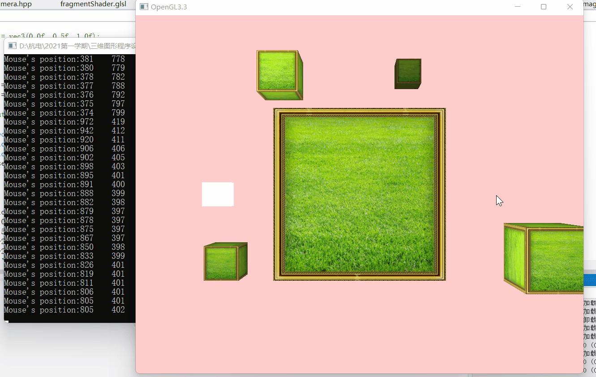
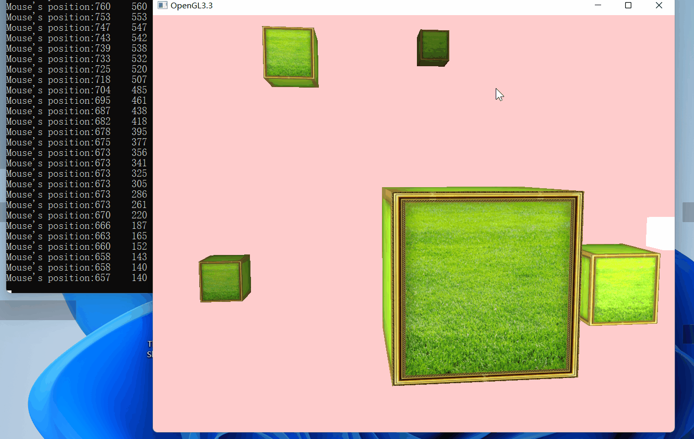
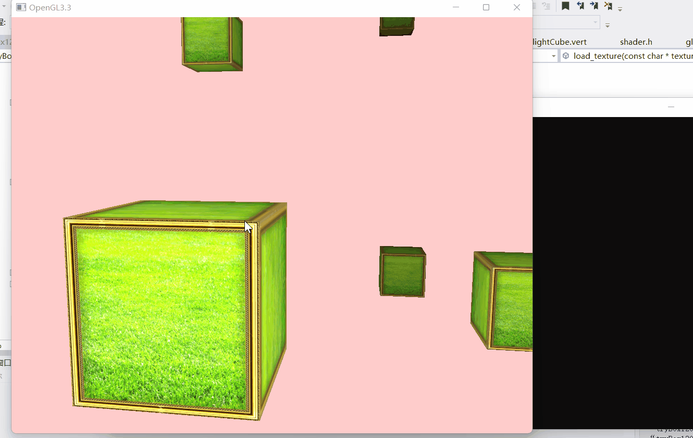

# OpenGL 光照与相机交互

## 项目概述

早期 C++/OpenGL 图形学课程项目，代码由本人独立完成，围绕可交互相机、多光源、纹理材质和 Phong 光照模型搭建基础实时渲染场景。

## 实现内容

- Shader 文件加载、编译、链接与 Uniform 设置封装；
- 方向光和多个点光源；
- Ambient、Diffuse、Specular 光照分量；
- 距离衰减与光源可视化；
- 键盘六自由度移动、鼠标视角旋转和滚轮缩放；
- 多个纹理立方体和独立材质参数。

## 演示

### 移动点光源

### 相机移动

### 滚轮缩放

## 目录

- `src/`：C++ 主程序、Camera 和 Shader 辅助类；
- `shaders/`：场景与光源的 Vertex/Fragment Shader；
- `media/`：历史演示 GIF。

## 依赖与限制

- 原项目使用 GLEW、GLFW、GLM 和 stb_image；第三方库没有复制到本仓库；
- 原 Visual Studio 工程包含本机绝对路径，因此没有上传；
- 原贴图授权来源不明确，因此没有上传，源码中的贴图文件名仅保留为历史引用；
- 项目代码由本人独立完成；OpenGL、Phong 光照和使用到的第三方库属于通用技术与依赖，不将其表述为本人原创框架；
- 这是基础图形学练习，不应表述为自研渲染引擎。

## 后续改进

- 使用 CMake 与包管理器重建可复现构建；
- 替换为自制或明确授权的贴图；
- 加入 Gamma Correction、Normal Mapping、Shadow Mapping 和性能统计；
- 清理控制台输出并重新录制无调试窗口的演示。
