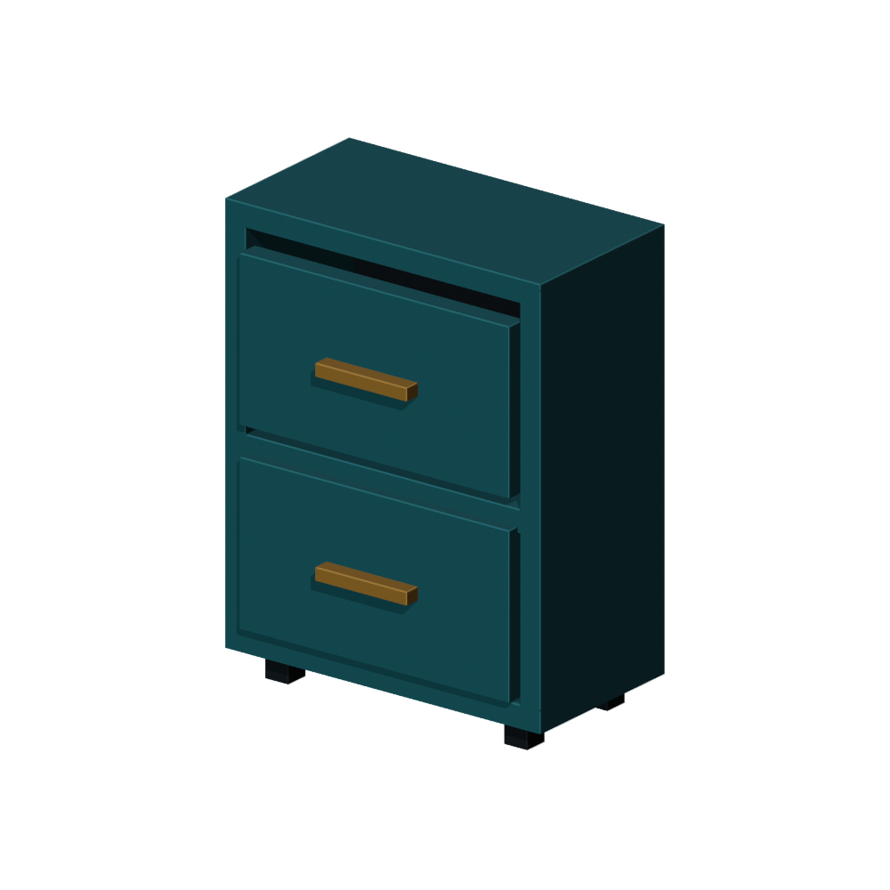

# Gen3D Asset Factory

一个 Blender 插件，用来检查静态 3D 资产，并在导出 GLB 后重新导入核对结果。

这版先处理资产交付中几类容易遗漏的问题：材质需要 UV 但网格没有 UV、图片引用丢失、退化面、命名不统一，以及格式转换后对象或尺寸发生变化。输入可以来自人工建模、程序化建模或生成式工具；插件本身不调用生成模型。

当前版本：**0.2.0 预览版**。已在 Windows / Blender 5.2.1 LTS 上测试。



工具柜用于测试规则和导出流程。上图是 Workbench 预览，不是 PBR 渲染对比。

## 试用

下载 [插件安装包](dist/gen3d_factory-0.2.0.zip)，在 Blender 的 Preferences → Add-ons → Install from Disk 中安装并启用。无需另外安装 Python 包。

1. 在 3D Viewport 按 N，打开 Gen3D 面板，点击 Create Demo Scene。
2. 初次扫描应显示 `17 assets | 3 errors | 0 warnings`：14 个柜体部件和 3 个故障方块。
3. 选择 `UV_MISSING`，点击 Select Problem Object。对这个方块做 Cube Projection，回到对象模式后重新扫描，缺 UV 错误应消失。
4. 只选中柜子的正常部件，指定 Report folder，点击 Preview Names，再点击 Export Verified GLB。
5. 成功后输出 `asset.glb` 和 HTML/JSON 报告；原对象名称和几何保持不变。

演示场景由 [demo.py](gen3d_factory/demo.py) 生成，不需要下载模型。Cube Projection 只用于这个方块的演示，不是通用的 UV 修复方案。

## 已实现

- 检查基础网格、退化面、多面共边、边界、松散元素和三角面预算。
- 根据材质实际需求检查 UV、图片引用、贴图尺寸及部分色彩空间设置。
- 输出带规则 ID 和处理建议的报告，支持对象级定位。
- 在临时副本中规范命名，导出 GLB，再按对象核对验证 ID、三角面数、包围盒和材质槽数。
- 对特定结构的高斯 PLY 检查字段、数据长度及数值，不把它当作普通网格。

检查不会改动源网格。交付失败时记录原因，未通过复验的候选文件不会命名为 `asset.glb`。

## 暂不支持

自动修复只做副本命名。拓扑修复、自动 UV、网格目录批处理和材质修复尚未实现。交付暂不接受修改器、形态键、动画、实例、程序材质和节点组。

`VERIFIED` 只表示报告列出的机器检查通过，不保证渲染效果一致。真实 AIGC 资产评估、PBR 渲染对照和大批量性能测试还未完成。

## 开发

在本项目目录运行：

```sh
python scripts/build_gen3d.py
blender --background --factory-startup --python-exit-code 1 --python scripts/test_gen3d_blender.py
blender --background --factory-startup --python-exit-code 1 --python scripts/test_gen3d_delivery.py
```

`blender` 需要在 PATH 中，或替换为本机可执行文件路径。构建输出位于 `Gen3D_build/`，不会覆盖 `dist/` 中的安装包。运行测试会生成工程、报告和预览图。

两组脚本在开发环境中分别通过 27 项和 32 项断言。测试使用原创网格与合成高斯数据，不依赖私有数据集。测试范围与复现方法见 [测试记录](docs/testing.md)，实现说明见 [技术笔记](docs/design.md)。

## 后续

下一步接入许可明确的真实模型，增加固定灯光下的材质对照，再补网格目录批处理。暂不扩展 GS 转网格或自动重拓扑。

## 作者与许可

Zoey King。开发过程中使用了 AI 辅助编程。

本子项目的代码、文档及脚本生成的演示内容按 [GPL-3.0-or-later](LICENSE) 分发。该许可不适用于作品集仓库中的其他项目。本目录不包含第三方模型、科研数据或生成式服务的输出资产。
